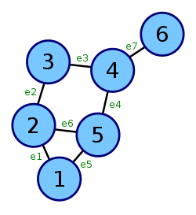
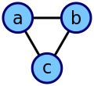
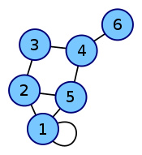

## [Графы]

---
### Матрица инцидентности

Строки соответствуют вершинам (V)
Столбцы соответствуют ребрам (E)



---
### Список смежности


Граф на картинке наверху имеет следующий список смежности:

```
[a] смежно к [b, c]
[b] смежно к [a, c]
[c] смежно к [a, b]
```
---
### Матрица смежности



Описывает отсутствие или присутствие ребра между вершинами